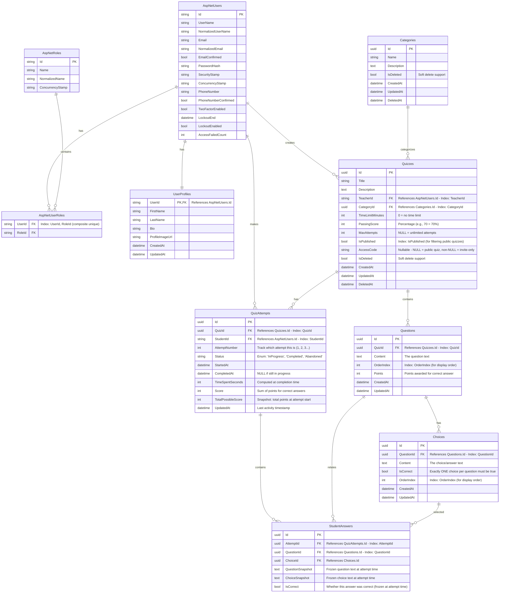

# Quizzy Database Schema

This document describes the database schema for the Quizzy application, an ASP.NET Core-based quiz platform supporting **multiple-choice quizzes only** (one correct answer per question).

## ERD Diagram

---

## Table Descriptions

### Identity Tables (ASP.NET Core Identity)

| Table             | Purpose                                                                                                |
| ----------------- | ------------------------------------------------------------------------------------------------------ |
| `AspNetUsers`     | Standard ASP.NET Core Identity users table. Stores authentication data for both teachers and students. |
| `AspNetRoles`     | Role definitions (e.g., "Teacher", "Student", "Admin").                                                |
| `AspNetUserRoles` | Many-to-many junction table linking users to roles. Includes `CreatedAt` for audit.                    |

---

### User Management

#### UserProfiles

Extends `AspNetUsers` with additional profile information.

| Column            | Type     | Description                                    |
| ----------------- | -------- | ---------------------------------------------- |
| `UserId`          | string   | PK & FK to `AspNetUsers.Id` (1:1 relationship) |
| `FirstName`       | string   | User's first name                              |
| `LastName`        | string   | User's last name                               |
| `Bio`             | string   | Optional biography/description                 |
| `ProfileImageUrl` | string   | URL to profile picture                         |
| `CreatedAt`       | datetime | Account creation timestamp                     |
| `TimeZone`        | string   | Optional timezone for scheduling               |
| `DateOfBirth`     | date     | Optional, for age verification                 |

---

### Quiz Content

#### Categories

Organizes quizzes into topic areas. Supports soft deletes to preserve historical data.

| Column        | Type     | Description                                |
| ------------- | -------- | ------------------------------------------ |
| `Id`          | uuid     | Primary key                                |
| `Name`        | string   | Category name (e.g., "Science", "History") |
| `Description` | text     | Detailed description                       |
| `CreatedAt`   | datetime | Creation timestamp                         |
| `IsDeleted`   | bool     | Soft delete flag                           |
| `DeletedAt`   | datetime | Deletion timestamp                         |

#### Quizzes

The main quiz entity, created by teachers and taken by students.

| Column             | Type     | Description                                 |
| ------------------ | -------- | ------------------------------------------- |
| `Id`               | uuid     | Primary key                                 |
| `Title`            | string   | Quiz title                                  |
| `Description`      | text     | Quiz description/instructions               |
| `TeacherId`        | string   | FK to `AspNetUsers.Id` - the quiz creator   |
| `CategoryId`       | uuid     | FK to `Categories.Id`                       |
| `TimeLimitMinutes` | int      | Time limit (0 = unlimited)                  |
| `PassingScore`     | int      | Minimum percentage to pass (e.g., 70)       |
| `MaxAttempts`      | int?     | Maximum attempts allowed (NULL = unlimited) |
| `IsPublished`      | bool     | Whether quiz is visible to students         |
| `AccessCode`       | string?  | **Invite-only: code required to access**    |
| `IsDeleted`        | bool     | Soft delete flag                            |
| `DeletedAt`        | datetime | Deletion timestamp                          |
| `CreatedAt`        | datetime | Creation timestamp                          |
| `UpdatedAt`        | datetime | Last update timestamp                       |

#### Questions

Individual questions within a quiz. Each question has multiple choices with exactly one correct answer.

| Column       | Type     | Description                             |
| ------------ | -------- | --------------------------------------- |
| `Id`         | uuid     | Primary key                             |
| `QuizId`     | uuid     | FK to `Quizzes.Id`                      |
| `Content`    | text     | The question text                       |
| `OrderIndex` | int      | Display order within the quiz (0-based) |
| `Points`     | int      | Points awarded for correct answer       |
| `IsDeleted`  | bool     | Soft delete flag                        |
| `DeletedAt`  | datetime | Deletion timestamp                      |
| `UpdatedAt`  | datetime | Last update timestamp                   |

#### Choices

Answer options for each question. **Exactly one choice per question must have `IsCorrect = true`**.

| Column       | Type     | Description                                  |
| ------------ | -------- | -------------------------------------------- |
| `Id`         | uuid     | Primary key                                  |
| `QuestionId` | uuid     | FK to `Questions.Id`                         |
| `Content`    | text     | The choice/answer text                       |
| `IsCorrect`  | bool     | **True for exactly one choice per question** |
| `OrderIndex` | int      | Display order (0-based)                      |
| `IsDeleted`  | bool     | Soft delete flag                             |
| `DeletedAt`  | datetime | Deletion timestamp                           |
| `UpdatedAt`  | datetime | Last update timestamp                        |

---

### Quiz Attempts & Scoring

#### QuizAttempts

Tracks each time a student takes a quiz.

| Column               | Type     | Description                                             |
| -------------------- | -------- | ------------------------------------------------------- |
| `Id`                 | uuid     | Primary key                                             |
| `QuizId`             | uuid     | FK to `Quizzes.Id`                                      |
| `StudentId`          | string   | FK to `AspNetUsers.Id`                                  |
| `AttemptNumber`      | int      | Sequential attempt number (1, 2, 3...)                  |
| `Status`             | string   | `InProgress`, `Completed`, or `Abandoned`               |
| `StartedAt`          | datetime | When the attempt began                                  |
| `CompletedAt`        | datetime | When the attempt finished (NULL if in progress)         |
| `TimeSpentSeconds`   | int      | Duration of attempt in seconds (computed at completion) |
| `Score`              | int      | Total points earned                                     |
| `TotalPossibleScore` | int      | **Snapshot** of total possible points at attempt start  |
| `UpdatedAt`          | datetime | Last activity timestamp                                 |

> **Why snapshot `TotalPossibleScore`?** Questions may be added/removed after the attempt. Storing the snapshot ensures accurate percentage calculations.

#### StudentAnswers

Records each answer given during a quiz attempt.

| Column             | Type | Description                                              |
| ------------------ | ---- | -------------------------------------------------------- |
| `Id`               | uuid | Primary key                                              |
| `AttemptId`        | uuid | FK to `QuizAttempts.Id`                                  |
| `QuestionId`       | uuid | FK to `Questions.Id`                                     |
| `ChoiceId`         | uuid | FK to `Choices.Id`                                       |
| `QuestionSnapshot` | text | Frozen question text at attempt time                     |
| `ChoiceSnapshot`   | text | Frozen choice text at attempt time                       |
| `IsCorrect`        | bool | Whether this answer was correct (frozen at attempt time) |

> **Why snapshots?** Questions and choices may change after an attempt. Snapshots preserve what the student actually saw.

---

## Cascade Delete Behavior

| FK Relationship                                | On Delete | Rationale                                                        |
| ---------------------------------------------- | --------- | ---------------------------------------------------------------- |
| `UserProfiles.UserId` → `AspNetUsers.Id`       | CASCADE   | Profile should be deleted if user is deleted                     |
| `AspNetUserRoles.UserId` → `AspNetUsers.Id`    | CASCADE   | Role assignments removed with user                               |
| `AspNetUserRoles.RoleId` → `AspNetRoles.Id`    | CASCADE   | Role assignments removed with role                               |
| `Quizzes.TeacherId` → `AspNetUsers.Id`         | NO ACTION | Prevent deleting users who created quizzes (soft delete instead) |
| `Quizzes.CategoryId` → `Categories.Id`         | NO ACTION | Prevent deleting categories with quizzes (soft delete instead)   |
| `Questions.QuizId` → `Quizzes.Id`              | CASCADE   | Questions deleted with quiz                                      |
| `Choices.QuestionId` → `Questions.Id`          | CASCADE   | Choices deleted with question                                    |
| `QuizAttempts.QuizId` → `Quizzes.Id`           | NO ACTION | Preserve attempt history                                         |
| `QuizAttempts.StudentId` → `AspNetUsers.Id`    | NO ACTION | Preserve attempt history                                         |
| `StudentAnswers.AttemptId` → `QuizAttempts.Id` | CASCADE   | Answers deleted with attempt                                     |
| `StudentAnswers.QuestionId` → `Questions.Id`   | NO ACTION | Preserve answer history                                          |
| `StudentAnswers.ChoiceId` → `Choices.Id`       | NO ACTION | Preserve answer history (use snapshots)                          |

> **Note:** Soft deletes are preferred over hard deletes for content tables. Cascade deletes are primarily for dependent data (choices → questions → quizzes).

---

## Indexes

| Table             | Columns                         | Purpose                                 |
| ----------------- | ------------------------------- | --------------------------------------- |
| `AspNetUserRoles` | `UserId`, `RoleId`              | Composite unique index for role lookups |
| `Quizzes`         | `TeacherId`                     | Find all quizzes by a teacher           |
| `Quizzes`         | `CategoryId`                    | Find all quizzes in a category          |
| `Quizzes`         | `IsPublished`                   | Filter published quizzes                |
| `Quizzes`         | `AccessCode`                    | Find quiz by access code (where not NULL) |
| `Questions`       | `QuizId`                        | Get all questions for a quiz            |
| `Questions`       | `OrderIndex`                    | Sort questions by display order         |
| `Choices`         | `QuestionId`                    | Get all choices for a question          |
| `QuizAttempts`    | `QuizId`, `StudentId`           | Find attempts for a quiz/student        |
| `QuizAttempts`    | `QuizId`, `StudentId`, `Status` | Query active/in-progress attempts       |
| `StudentAnswers`  | `AttemptId`                     | Get all answers for an attempt          |
| `StudentAnswers`  | `AttemptId`, `QuestionId`       | Composite for grading/lookup            |
| `StudentAnswers`  | `QuestionId`                    | Analyze question performance            |

---

## Constraints

| Table             | Constraint         | Type        | Description                                            |
| ----------------- | ------------------ | ----------- | ------------------------------------------------------ |
| `AspNetUserRoles` | `UserId`, `RoleId` | UNIQUE      | Prevent duplicate role assignments                     |
| `Quizzes`         | `PassingScore`     | CHECK       | Must be 0-100                                          |
| `Quizzes`         | `TimeLimitMinutes` | CHECK       | Must be >= 0                                           |
| `QuizAttempts`    | `Status`           | CHECK       | Must be 'InProgress', 'Completed', or 'Abandoned'      |
| `QuizAttempts`    | `Score`            | CHECK       | Must be >= 0 and <= TotalPossibleScore                 |
| `Questions`       | `OrderIndex`       | CHECK       | Must be >= 0                                           |
| `Questions`       | `Points`           | CHECK       | Must be > 0                                            |
| `Choices`         | `OrderIndex`       | CHECK       | Must be >= 0                                           |
| `Choices`         | (per Question)     | APPLICATION | Exactly one choice per question has `IsCorrect = true` |

> **Note:** The "exactly one correct answer" constraint for Choices is difficult to enforce purely in SQL. It should be enforced at the application layer with database validation as a secondary check.

---

## Design Decisions

### Choice-Based Questions Only

This schema supports **multiple-choice questions with exactly one correct answer**. Essay, short-answer, and other open-ended question types are **not supported**.

### Soft Deletes

`Quizzes`, `Questions`, `Choices`, and `Categories` use soft deletes (`IsDeleted`/`DeletedAt`) to:

- Preserve historical quiz attempts and scores
- Allow "undelete" functionality
- Maintain data integrity for completed attempts

### Snapshots for Attempts

`StudentAnswers` stores frozen copies of question and choice text to ensure:

- Accurate record of what the student saw
- No data corruption if questions are edited later
- Ability to review past attempts even after content changes

### Single Correct Answer

The `Choices.IsCorrect` flag enforces that exactly one choice per question is correct. This simplifies:

- Automatic grading
- Score calculation
- Answer validation

### Invite-Only Quizzes

The `Quizzes.AccessCode` column enables teachers to restrict quiz access to students with a specific code:

- **`AccessCode = NULL`**: Public quiz, any student can access (if published)
- **`AccessCode = "CODE123"`**: Invite-only quiz, students must enter the code to access
- Teachers generate and distribute codes to intended students
- Access code validation occurs at quiz entry/attempt creation time
